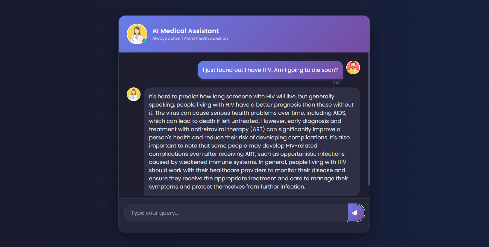

````markdown
# Medical-RAG-Chatbot
### Build a Complete Medical Chatbot with LLMs (TinyLlama), LangChain, Pinecone, Flask & AWS



This project implements a Retrieval-Augmented Generation (RAG) chatbot capable of answering medical questions based on a custom knowledge base (PDFs). It utilizes the **TinyLlama-1.1B** model for generation and **Hugging Face embeddings**, making it completely open-source and cost-effective.

## Techstack Used:

- **Python**
- **LangChain** (Framework for LLM applications)
- **Flask** (Web Framework)
- **HuggingFace** (LLM: TinyLlama-1.1B, Embeddings: all-MiniLM-L6-v2)
- **Pinecone** (Vector Database)
- **AWS** (Deployment)

---

## How to run?

### STEPS:

### 1. Clone the repository

```bash
git clone [https://github.com/Pratham1603/Medical-RAG-Chatbot.git](https://github.com/Pratham1603/Medical-RAG-Chatbot.git)
````

### 2\. Create a conda environment

```bash
conda create -n medibot python=3.10 -y
```

```bash
conda activate medibot
```

### 3\. Install the requirements

```bash
pip install -r requirements.txt
```

### 4\. Configure Environment Variables

Create a `.env` file in the root directory and add your Pinecone and HuggingFace credentials:

```ini
PINECONE_API_KEY = "xxxxxxxxxxxxxxxxxxxxxxxxxxxxx"
HUGGINGFACEHUB_ACCESS_TOKEN = "xxxxxxxxxxxxxxxxxxxxxxxxxxxxx"
```

### 5\. Ingest Data (Create Vector Store)

Run the following command to process your PDFs and store embeddings in Pinecone:

```bash
python store_index.py
```

### 6\. Run the Application

Finally, run the Flask app:

```bash
python app.py
```

Now, open your browser and go to:

```bash
http://localhost:8080
```

-----

## AWS CI/CD Deployment with Github Actions

### 1\. Login to AWS console.

### 2\. Create IAM user for deployment

**Grant the following permissions (Policies):**

1.  `AmazonEC2ContainerRegistryFullAccess`
2.  `AmazonEC2FullAccess`

**Description:**

1.  **EC2 access:** Virtual machine to run the app.
2.  **ECR:** Elastic Container Registry to save your docker image.

### 3\. Create ECR repo to store the docker image

  - Create a repository named `medicalbot` (or similar).
  - **Save the URI:** `your-account-id.dkr.ecr.your-region.amazonaws.com/medicalbot`

### 4\. Create EC2 machine (Ubuntu)

### 5\. Install Docker in EC2 Machine:

**Optional (Update system):**

```bash
sudo apt-get update -y
sudo apt-get upgrade
```

**Required (Install Docker):**

```bash
curl -fsSL [https://get.docker.com](https://get.docker.com) -o get-docker.sh
sudo sh get-docker.sh
sudo usermod -aG docker ubuntu
newgrp docker
```

### 6\. Configure EC2 as self-hosted runner:

Go to your GitHub Repo -\> **Settings** \> **Actions** \> **Runners** \> **New self-hosted runner** \> Choose Linux \> Run the provided commands one by one in your EC2 terminal.

### 7\. Setup GitHub Secrets:

Go to your GitHub Repo -\> **Settings** \> **Secrets and variables** \> **Actions** \> **New repository secret**. Add the following:

  - `AWS_ACCESS_KEY_ID`
  - `AWS_SECRET_ACCESS_KEY`
  - `AWS_DEFAULT_REGION` (e.g., us-east-1)
  - `ECR_REPO` (The URI you saved in Step 3)
  - `PINECONE_API_KEY`
  - `HUGGINGFACEHUB_ACCESS_TOKEN`

<!-- end list -->

````

### **Step 3: Upload the Changes**
Run these commands in your terminal to push the new README and the image file to GitHub:

```bash
git add .
git commit -m "Updated README with screenshot and fixed commands"
git push origin main
````